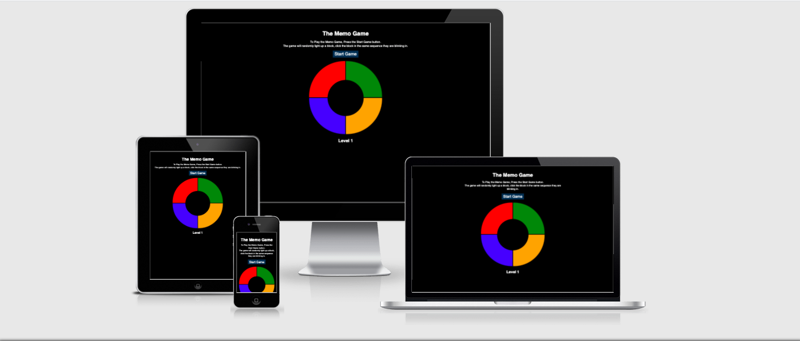

# [The Memo Game](https://mrmorkeberg.github.io/Memgame/)

Website presents the memory game: The Memo Game, which is a fun memory game to be played with friends and family. The game will light up a block and then the player shall click on it. The game will then light up the first block and then another randon block. For each level there will be added another block and making the memory game harder and harder. See who is best, and get the highest score. 

# Table of content

- [UX](#ux) 

    - [Website owners goals](#website-owners-goals)

    - [User goals](#user-goals)

        - [Players who want to play the game for fun](#players-for-fun)

        - [Players for memory training](#players-for-memory-training)
    
    - [User stories](#user-stories)

        - [As a player who want to play a fun game with friends and family](#as-a-player-who-want-to-play-a-fun-game-with-friends-and-family)

        - [As a player who wants to train my memory](#as-a-player-who-wants-to-train-my-memory)

    - [Design choises](#design-choises)

        - [Colors](#colors)

        - [Fonts](#fonts)

        - [Images](#images)

        - [Wireframes](#wireframes)

- [Features](#features)

- [Technologies Used](#technologies-used)

- [Testing](#testing)
    - [Validator Testing](#validator-testing)
    - [Functionality Testing](#functionality-testing)
    - [Compatibility Testing](#compatibility-testing)
    - [User stories testing](#user-stories-testing)

# User Experience (UX)

## Website owners goals

The Website owners goals is to have a fun game and to build their brand. For the Website owners their are a number of ways to make money of the game, either by selling the game, or if the game is free, by ads on the game. 

## User goals

### **Players for fun**

The goal is to attract players who wants to have fun playing the game against friends and family.

### **Players for memory training**

The goal is to attract playser who wants to train their memory and compete against them self. 

## User stories

### **As a player who want to play a fun game with friends and family**
- I want a fun game to play
- I want to play the game against my friends and family
- I want the game to be more and more challenging
- I want to see what level I am on
- I want to see my final score

### **As a player who wants to train my memory**
- I want a game to train my memory
- I want to see what level I am on
- I want to see my final score

[Back to Table of content](#table-of-content)

## Design choises

### **Colors**

- Main background color is black
- Text color is white 
- Panel hover is #00ffff
- Start button color is #0B3152
- Colors of the game is red, green, blue and orange
- Color of the active block is #fff
- Color of ul is #fff

### **Fonts**

Main font is Helvetica with sans-serif as backup.

### **Images**

Images are screendumps of the different bugs I have encountered.

### **Wireframes**

I used Balsamiq Wireframes to create the Wireframes

- Desktop Wirefram  - [View](assets/images/wireframes/memgame-desktop.pdf)
- Tablet Wirefram - [View](assets/images/wireframes/memgame-ipad.pdf)
- Mobile phone Wirefram - [View](assets/images/wireframes/memgame-iphone.pdf)

[Back to Table of content](#table-of-content)

# Features

The website is responsive and has interactive elements. The website consists of 1 pages, where the game is hidden until the player presses the Start Game button, then the game appear. During the game a level indikator will show what level the player is on. When the player fails a Score will be show together with the final level and a Restart Game button. 

# Technologies Used

### Languages Used

* #### HTML5
* #### CSS
* #### Javescript

### Git 

* Git was used for version control by utilizing the Gitpod terminal to commit to Git and Push to GitHub

### GitHub

* Github was used as a software hosting platform to store the projects code after being pushed from Git

### Gitpod

* Gitpod was used as a development hosting platform

### Photoshop

* Photoshop was used to resizing images and editing pictures for the website.

### Balsamiq

* Balsamiq was used to create the wireframes during the design process.

### ami.responsivedesign

* Am I Responsive was used to do the Mockup.

[Back to Table of content](#table-of-content)

# Testing

## Validator testing

The W3C Markup Validator, W3C CSS Validator Services and the Jshint were used to validate every page of the project.

- HTML
    - No errors were returned when passing through the official - [View](assets/images/validator/html-validator.png)
- CSS
    - No errors were found when passing through the official - [View](assets/images/validator/css-validator.png)

- Javescript
    - No errors were returned when passing through the official - [View](assets/images/validator/jshint-validator.png)

## Functionality testing 

Chrome developer tools was used throughout the project for testing and solving problems with responsiveness, style issues and Javescript problems

## Compatibility testing
 Site was tested across multiple virtual mobile devices and browsers. I checked all supported devices in both Mozilla web developer tolls and Chrome developer tools.

 ## User stories testing

 ### As a business owner:
 - The Website owners goals is to have a fun game and to build their brand. 
  > The game is fun to play. You can play by your self or you can play with friends and family, and you can compare score.

 ### As a player who want to play a fun game with friends and family
- I want a fun game to play
> The game is fun to play
- I want to play the game against my friends and family
> You can play against friends and family
- I want the game to be more and more challenging
> The longer you play the game the more blocks you will need to remember and the harder it will be
- I want to see what level I am on
> You can see what level you are on below the game
- I want to see my final score
> When you are finish with the game, you will be able to see your final score
